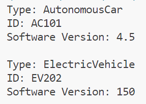

# 24K-0762-OOP-LAB-10
# C++ Code Repository

## Preview
Here are the sample outputs of the programs:

### Task 1 Output:


### Task 2:


### Task 3:


### Task 4:


### Task 5:


### Task 6:


### Task 7:


### Task 8:


### Task 9:


### Task 10:


---

## Code
Below are the C++ programs:

### Program 1: 
```cpp

#include<iostream>
#include<fstream>
using namespace std;
int main(){
    ifstream file;
    file.open("vehicle.txt",ios::in);
    if(file.is_open()){
        string line;
        while(getline(file,line)){
            cout<<line<<endl;
        }
    }
    else{
        cout<<"File not opened"<<endl;
        exit(1);
    }
    return 0;
}


## Code
Below are the C++ programs:

### Program 2: 
```cpp
#include<iostream>
#include<fstream>
#include<sstream>
#include<string>
using namespace std;
int main(){
    ifstream file;
    file.open("vehicle.txt",ios::in);
    if(file.is_open()){
        string line;
        while(getline(file,line)){
            if(!(line.find(' ')==0||line.substr(0,2)=="//")){
                istringstream input_line(line);
                string Type,ID,Name,Year,ExtraData,Certification;
                getline(input_line,Type,',');
                getline(input_line,ID,',');
                getline(input_line,Name,',');
                getline(input_line,Year,',');
                getline(input_line,ExtraData,',');
                getline(input_line,Certification);
                cout<<line<<endl;
                cout<<"Type: "<<Type<<endl;
                cout<<"ID: "<<ID<<endl;
                cout<<"Name: "<<Name<<endl;
                cout<<"Year: "<<Year<<endl;
                cout<<"Extra Data: "<<ExtraData<<endl;
                cout<<"Certification: "<<Certification<<endl<<endl;
            }            
        }
    }
    else{
        cout<<"File not opened"<<endl;
        exit(1);
    }
    return 0;
}


## Code
Below are the C++ programs:

### Program 3: 
```cpp
#include<iostream>
#include<fstream>
#include<sstream>
#include<string>
using namespace std;
int main(){
    ifstream file;
    file.open("vehicle.txt",ios::in);
    if(file.is_open()){
        string line;
        while(getline(file,line)){
            if(!(line.find(' ')==0||line.substr(0,2)=="//")){
                istringstream input_line(line);
                string Type,ID,Name,Year;
                getline(input_line,Type,',');
                getline(input_line,ID,',');
                getline(input_line,Name,',');
                getline(input_line,Year,',');
                bool is_year_valid=true;
                for(int i=0;i<Year.size();i++){
                    if(!(Year[i]>='0'&&Year[i]<='9')){
                        is_year_valid=false;
                        break;
                    }
                }
                if(is_year_valid){
                    int year_in_int=stoi(Year);
                    cout<<line<<endl<<"Year: "<<year_in_int<<endl<<endl;
                }
                else{
                    cout<<"The purpose of stoi is to covert string to integer"<<endl<<endl;
                }
            }            
        }
    }
    else{
        cout<<"File not opened"<<endl;
        exit(1);
    }
    return 0;
}


## Code
Below are the C++ programs:

### Program 4: 
```cpp

#include<iostream>
#include<fstream>
#include<sstream>
#include<string>
using namespace std;
int main(){
    ifstream file;
    file.open("vehicle.txt",ios::in);
    if(file.is_open()){
        std::string line;
        while(getline(file,line)){
            if(!(line.find(' ')==0||line.substr(0,2)=="//")){
                istringstream input_line(line);
                std::string Type,ID,Name,Year,ExtraData;
                getline(input_line,Type,',');
                getline(input_line,ID,',');
                getline(input_line,Name,',');
                getline(input_line,Year,',');
                getline(input_line,ExtraData,',');
                if(Type=="AutonomousCar"){
                    size_t position;
                    position=ExtraData.find(':');
                    if(position!=std::string::npos){
                    std::string software_version_in_string=ExtraData.substr(position+1);
                        float software_version_in_float=stof(software_version_in_string);
                        cout<<"Type: "<<Type<<endl;
                        cout<<"ID: "<<ID<<endl;
                        cout<<"Software Version: "<<software_version_in_float<<endl<<endl;
                    }                    
                }
                else{
                    if(Type=="ElectricVehicle"){
                        size_t position;
                        position=ExtraData.find(':');
                        if(position!=std::string::npos){
                            std::string battery_capacity_in_string=ExtraData.substr(position+1);
                            int battery_capacity_in_int=stof(battery_capacity_in_string);
                            cout<<"Type: "<<Type<<endl;
                            cout<<"ID: "<<ID<<endl;
                            cout<<"Software Version: "<<battery_capacity_in_int<<endl<<endl;
                        }
                    }
                }
            }            
        }
    }
    else{
        cout<<"File not opened"<<endl;
        exit(1);
    }
    return 0;
}


## Code
Below are the C++ programs:

### Program 5: 
```cpp
#include<iostream>
#include<fstream>
#include<sstream>
#include<string>
using namespace std;
int main(){
    ifstream file;
    file.open("vehicle.txt",ios::in);
    if(file.is_open()){
        std::string line;
        while(getline(file,line)){
            if(!(line.find(' ')==0||line.substr(0,2)=="//")){
                istringstream input_line(line);
                std::string Type,ID,Name,Year,ExtraData;
                getline(input_line,Type,',');
                getline(input_line,ID,',');
                getline(input_line,Name,',');
                getline(input_line,Year,',');
                getline(input_line,ExtraData,',');
                if(Type=="AutonomousCar"){
                    size_t position;
                    position=ExtraData.find(':');
                    if(position!=std::string::npos){
                    std::string software_version_in_string=ExtraData.substr(position+1);
                        float software_version_in_float=stof(software_version_in_string);
                        cout<<"Type: "<<Type<<endl;
                        cout<<"ID: "<<ID<<endl;
                        cout<<"Software Version: "<<software_version_in_float<<endl<<endl;
                    }                    
                }
                else if(Type=="ElectricVehicle"){
                    size_t position;
                    position=ExtraData.find(':');
                    if(position!=std::string::npos){
                        std::string battery_capacity_in_string=ExtraData.substr(position+1);
                        int battery_capacity_in_int=stof(battery_capacity_in_string);
                        cout<<"Type: "<<Type<<endl;
                        cout<<"ID: "<<ID<<endl;
                        cout<<"Software Version: "<<battery_capacity_in_int<<endl<<endl;
                    }
                }
                else if(Type=="HybridTruck"){
                    size_t pos_colon,pos_pipe;
                    pos_colon=ExtraData.find(':');
                    pos_pipe=ExtraData.find('|');
                    cout<<"Type: "<<Type<<endl;
                    cout<<"ID: "<<ID<<endl;
                    if(pos_colon!=std::string::npos){
                        std::string cargo_valiue_in_string=ExtraData.substr(pos_colon+1,pos_pipe-pos_colon-1);
                        int cargo_value_in_int=stoi(cargo_valiue_in_string);
                        cout<<"Cargo Value: : "<<cargo_value_in_int<<endl;
                    }
                    if(pos_pipe!=std::string::npos){
                        std::string battery=ExtraData.substr(pos_pipe+1,ExtraData.size()-pos_pipe-1);
                        cout<<battery<<endl;                        
                        size_t pos_colon=battery.find(':');
                        if(pos_colon!=std::string::npos){
                            std::string battery_value_in_string=battery.substr(pos_colon+1,battery.size()-pos_colon-1);
                            int battery_value_in_int=stoi(battery_value_in_string);
                            cout<<"Battery Value: "<<battery_value_in_int<<endl<<endl;    
                        }
                    }
                }
            }            
        }
    }
    else{
        cout<<"File not opened"<<endl;
        exit(1);
    }
    return 0;
}

## Code
Below are the C++ programs:

### Program 6: 
```cpp
#include<iostream>
#include<fstream>
using namespace std;
class InventoryItem{
    public:
        int itemID;
        char itemName[20];
};
int main(){
    ofstream output_file;
    InventoryItem item1;
    output_file.open("inventory.dat",ios::binary);
    cout<<"Enter item id: ";
    cin>>item1.itemID;
    cout<<"Enter item name: ";
    cin>>item1.itemName;
    output_file.write((char*)&item1,sizeof(item1));
    output_file.close();
    ifstream input_file;
    input_file.open("inventory.dat",ios::binary);
    InventoryItem item2;
    input_file.read((char*)&item2,sizeof(item2));
    cout<<endl<<"Item ID: "<<item2.itemID<<endl;
    cout<<"Item Name: "<<item2.itemName;
    input_file.close();
    return 0;
}


## Code
Below are the C++ programs:

### Program 7: 
```cpp
#include<iostream>
#include<fstream>
using namespace std;
int main(){
    ofstream file;
    file.open("sensor_log.tct",ios::out);
    file<<"Sensor 1: 25.5 C"<<endl; 
    streampos pos=file.tellp();
    cout<<"Position after performing write operation: "<<pos<<endl;
    file<<"Sensor 2: 98.1 %RH"<<endl;
    pos=file.tellp();
    cout<<"Position after performing write operation: "<<pos<<endl;
    file.close(); 
    return 0;
}


## Code
Below are the C++ programs:

### Program 8: 
```cpp
#include<iostream>
#include<fstream>
using namespace std;
int main(){
    ofstream file1;
    file1.open("config.txt");
    file1<<"AAAAABBBBBCCCCCC";
    file1.close();
    fstream file2;
    file2.open("config.txt",ios::in|ios::out);
    file2.seekp(5,ios::beg);
    file2<<"XXXXX";
    file2.close();
    file2.open("config.txt",ios::in|ios::out);
    string line;
    file2.seekp(0);
    file2>>line;
    cout<<line;
    file2.close();
    return 0;
}


## Code
Below are the C++ programs:

### Program 9: 
```cpp

#include<iostream>
#include<fstream>
using namespace std;
int main(){
    ifstream file;
    char content[11];
    file.open("large_log.txt");
    if(file.is_open()){
        file.read(content,10);
        cout<<"Current Position after reading 1st time: "<<file.tellg()<<endl;
        file.read(content,10);
        cout<<"Current Position after reading 2nd time: "<<file.tellg()<<endl;
        file.close();
    }
    else{
        cout<<"File not opened";
        exit(1);
    }
    return 0;
}


## Code
Below are the C++ programs:

### Program 10: 
```cpp

#include<iostream>
#include<fstream>
using namespace std;
int main(){
    ifstream file;
    file.open("data_records.txt");
    if(!file){
        cout<<"File not opened";
        exit(1);
    }
    else{
        string line;
        file.seekg(0,ios::beg);
        file.seekg(20,ios::beg);
        getline(file,line);
        cout<<line<<endl;
        file.close();
    }
    return 0;
}


 


